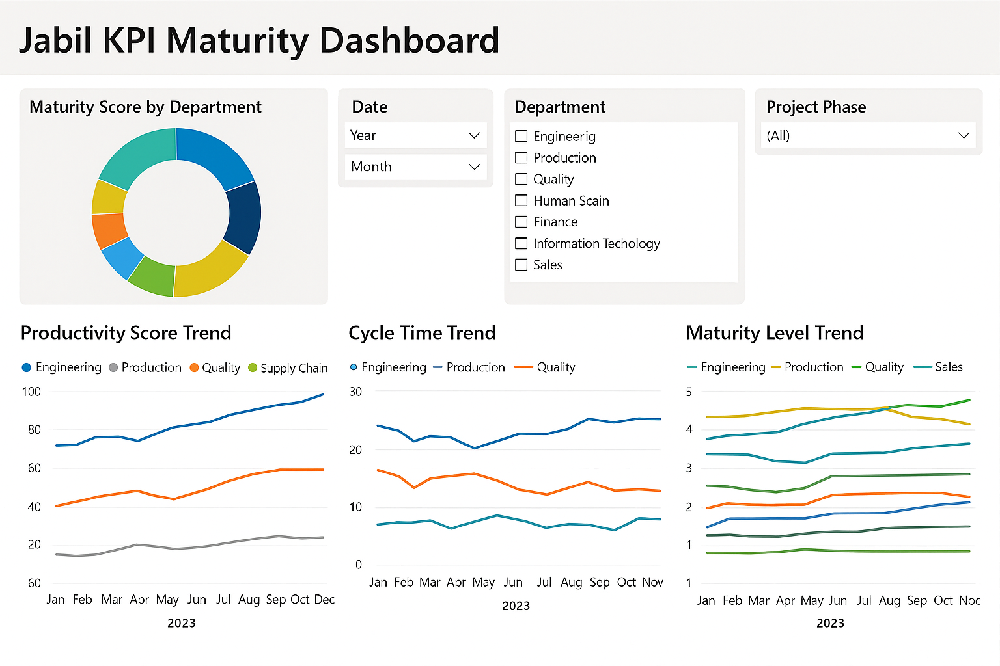

# Jabil KPI Maturity Dashboard 📈

**Power BI dashboard** designed to automate performance tracking across 8 departments at Jabil Circuit Ltd. This tool helped leadership monitor operational maturity and prioritize continuous improvement efforts.

---

## 🔍 Project Overview

This dashboard centralizes key KPIs and maturity evaluation metrics to offer a unified view of departmental performance. It replaced manual reports with real-time, interactive visualizations, enabling data-informed strategy development.

---

## 🧰 Tools & Technologies

- **Power BI** (visualization and dashboarding)
- **Excel** (raw data structuring and modeling)
- **SQL** (data queries and transformation)
- **SharePoint** (data access and sharing)

---

## 📌 Key Features

- 🧭 Tracks maturity levels across **8 functional departments**
- ⏱ Real-time monitoring of KPIs such as productivity, cycle time, and quality scores
- 📊 Dynamic filters for time, department, and project phase
- 📉 Highlights underperforming areas to guide leadership decisions
- 🟢 Increased data transparency, enabling **12% productivity gain**

---

## 🚀 Impact

- Empowered management with a **real-time view of operational health**
- Reduced manual reporting workload by **10+ hours/week**
- Informed resource allocation and continuous improvement roadmaps
- Recognized at Jabil’s **regional best practices forum**

---

## 📷 Dashboard Preview

---

## 📁 Files

- `sample-kpi-data.xlsx`: Mockup of KPI tracking dataset - [mock_kpi_data.xlsx](./mock_kpi_data.xlsx)
- `maturity-dashboard.pbix`: Power BI file (with sample data)
- `dashboard-design-guide.pdf`: Visual wireframe and layout logic
- `README.md`: Project documentation

---

## 🔐 Note

All data in this repository has been anonymized or simulated to protect proprietary and client information. The structure and methodology reflect the original project design.

---

## 🙋‍♀️ About Me

**Zhiyun (Verina) Qi**  
Cross-functional analyst with a passion for automation and visualization. I specialize in building dashboards that drive operational efficiency.

🔗 [LinkedIn](https://www.linkedin.com/in/verina-qi)  
📧 zhiyunqi1226@163.com  
